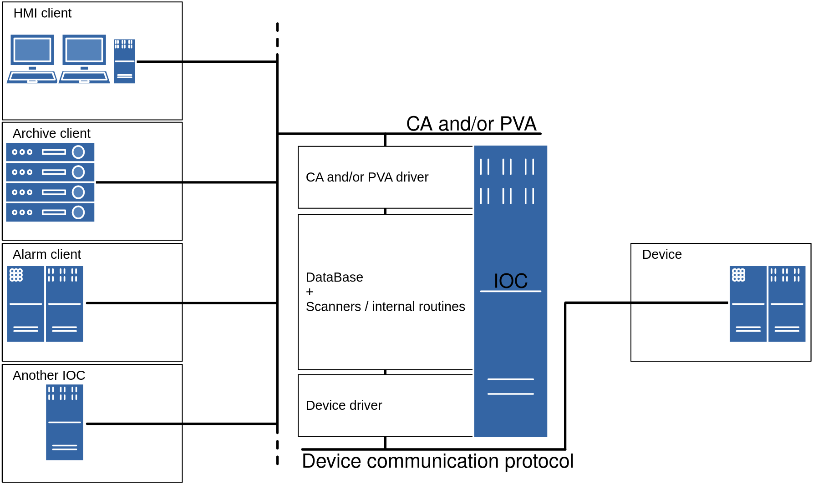

# EPICS meeting Paris-Saclay 2026, Workshop: Beginners first introduction to EPICS

## What is EPICS?

EPICS stands for **E**xperimental **P**hysics and **I**ndustrial **C**ontrol **S**ystem.
EPICS is a set of software tools and applications.
This set provides a software infrastructure for use in building distributed control systems 
in order to operate devices such as particle accelerators,
large experiments and major telescopes.
Such distributed control systems typically comprise tens or even hundreds of computers,
networked together to allow communication between them
and to provide control and feedback of the various parts of the device (generaly from a control room).

## Intro

This workshop will take the form of a demonstration,
and this document will serve as a guide.
Hopefully, anyone should be able to reproduce the demonstration using this document.

EPICS concepts will be introduced as we go.

This guide will show how to create and run an EPICS IOC
(Input/Output Controller - an "EPICS server")
from scratch.

An EPICS IOC is the centerpiece of EPICS:
On one side, an IOC will communicate with one (or more) device(s), 
think of equipement like power supply unit, motors, solenoid valves, etc.
On the other side,
an IOC will communicate with its clients.
So an IOC will forward commands from the clients to the devices,
and read-back data from the devices to the clients
(we will discuss IOCs in more details later).

This guide aims to be as standard as possible,
i.e. not specific to an EPICS environment
like [e3](https://e3.pages.ess.eu/)
or [EPNix](https://epics-extensions.github.io/EPNix/nixos-25.11/)
(EPICS environment are tools used to package and run EPICS),
nor specific to any particular work method that might be found in some institutions.

## References

- ⭐️ <https://epics-controls.org>
- ⭐️ <https://docs.epics-controls.org>
- ⭐️ <https://docs.epics-controls.org/projects/base/en/latest/ComponentReference.html>
- ⭐️ <https://epics-extensions.github.io/EPNix/nixos-25.11/glossary.html>
- <https://docs.epics-controls.org/projects/how-tos/en/latest/getting-started/installation.html>
- <https://docs.epics-controls.org/en/latest/appdevguide/gettingStarted.html?highlight=Shell#chap:IOCShell>
- <https://epics.anl.gov/index.php>
- <https://epics.anl.gov/base/index.php>
- <https://epics.anl.gov/modules/index.php>
- <https://epics.anl.gov/extensions/index.php>
- <https://epics.anl.gov/download/index.php>
- <https://epics.anl.gov/tech-talk/index.php>
- <https://epics.anl.gov/docs/training.php>

##  Prerequisites

- A [Github](https://github.com/) account

## Setup on Linux

First, let's setup our work environment.
For this, we will use [Github codespaces](https://github.com/codespaces):

- Go to <https://github.com/codespaces> 
- Login with your github account
- Click "Use this template" under the "Blank" template
- Wait a few seconds for the environment to load
- Maximize the "TERMINAL" view,
  every command in this guide will have to be executed in this terminal
- `cat /etc/os-release` should return :

  ```console
  PRETTY_NAME="Ubuntu 24.04.3 LTS"
  NAME="Ubuntu"
  VERSION_ID="24.04"
  VERSION="24.04.3 LTS (Noble Numbat)"
  VERSION_CODENAME=noble
  ID=ubuntu
  ID_LIKE=debian
  ...
  ```

So,
what we should read here is that our work environment is on Linux
(using a Linux distribution called Ubuntu, based on Debian).

This is a common OS for EPICS development,
so this guide will focus on this one.

ℹ️ Keep in mind that Windows or MacOS can also be used for EPICS.
See the below documentation for more details about this:
- <https://docs.epics-controls.org/en/latest/getting-started/installation-linux.html>
- <https://docs.epics-controls.org/en/latest/getting-started/installation-windows.html>
- <https://docs.epics-controls.org/en/latest/getting-started/os-specifics.html>

## EPICS base

The EPICS base is the main dependency needed to create an EPICS IOC.

This EPICS base installation method is the same regardless of the EPICS version (`3` or `7`).
In this guide,
EPICS `7` will be installed
(the latest stable version at the time of writing this guide,
which is the recommended one).

### Create the `epics` group and install EPICS base dependencies

The current user should be called `codespace`.

The bellow command:

```bash
echo $USER
```
should return `codespace`.

With that in mind,
lets create an `epics` group and add the current user to this group:

```bash
sudo groupadd epics
sudo usermod -aG epics $USER
newgrp epics
groups
```

Then, lets install some dependencies
(for Debian based Linux distribution):

```bash
sudo apt upgrade
sudo apt update
sudo apt install wget git                        # needed to retrieve the EPICS base, modules/supports, etc
sudo apt install build-essential libreadline-dev # EPICS base dependencies
```

Side note: for Redhat based Linux distribution,
see <https://docs.epics-controls.org/en/latest/getting-started/linux-packages.html>.

### Create the `/opt/epics` directory and install the EPICS base inside it

Let's create the `/opt/epics` directory:

```bash
sudo mkdir /opt/epics
sudo chown root:epics /opt/epics && sudo chmod 775 /opt/epics
sudo chmod g+s /opt/epics # set setgid bit for files and directories under /opt/epics to inherit group rights
```

The last commands are usefull because it apply the group rights (`epics`) to `/opt/epics`,
and specify that every file or directory created in `/opt/epics` will automatically inherit those group rights
(so we won't have to bother owner and group rights anymore).

Now, let's download and build the EPICS base (`7`) from source.

Check the latest release of the EPICS base here: <https://github.com/epics-base/epics-base/releases>
(e.g. `7.0.10` at the time of writing this guide).

Download it:

```bash
cd /opt/epics
wget https://github.com/epics-base/epics-base/releases/download/R7.0.10/base-7.0.10.tar.gz
tar xvf base-7.0.10.tar.gz
rm base-7.0.10.tar.gz
ln -s base-7.0.10 base
```

Export it to the `PATH`,
by editing `$HOME/.bashrc` 
(or `.profile`, `.zshrc`, `.zshenv`, etc)
and adding the folling line at the end of this file:

```bash
export EPICS_BASE=/opt/epics/base
export EPICS_HOST_ARCH=$(${EPICS_BASE}/startup/EpicsHostArch)
export PATH=${EPICS_BASE}/bin/${EPICS_HOST_ARCH}:${PATH}
```

Then apply this configuration by sourcing it:

```bash
source $HOME/.bashrc
```

Now, let's build the base:

```bash
cd /opt/epics/base
make clean && make && echo OK || echo KO # on github codespace, this command can take about 10-15 minutes to complete
```

While the base is compiling,
you can already start to read the next section ("What is an IOC"),
and come back to check the build result afterwards.

Now that the EPICS base is installed and built,
let's shift our focus from the epics-base 
to the main topic of this workshop.
So, let's move right on to the IOC.


## What is an IOC?

Like said in the introduction,
an IOC (Input/Output Control) is an "EPICS server".

Here is a simplistic diagram illustrating how an IOC integrates into the EPICS ecosystem:



In this diagram, on the right side (device side),
the IOC will communicate with one (or more) device(s), 
think of industrial equipment like power supply unit, motors, solenoid valves, etc.
It will communicate with that equipement using the communication protocol used by the device.

In this diagram, on the left side (client side),
the IOC will communicate with its clients,
like HMI systems, archive systems, alarm systems, or even other IOCs, etc.
It will communicate with those clients
using the [CA (Channel Access)](https://docs.epics-controls.org/en/latest/ca-ref/introduction.html)
and/or [PVA (PV Access)](https://docs.epics-controls.org/en/latest/pv-access/protocol.html)
communication protocols.

In order to "connect" the client side to the device side,
an IOC will host and serve variables
(also called PV - Process Variables)
to its clients (allowing them to interact with the device).

Examples:

- A client will send a command by writing on a PV,
  in order for the IOC to forward that command to the device.

- A client will monitor a PV,
  in order to trigger an alarm if it rises above or drops below a certain threshold.
  That PV is kept updated by the IOC so that it reflects the associated value on the device.
  So, the device reports a value,
  and the IOC parses the value from the device,
  than the device convert it into a human readable value and assign it to a PV
  which will be transmitted it to every subscribed EPICS client(s) over CA and/or PVA.

Those PVs are specified by the IOC developper (you!) in the IOC database
(more about it in a following section).

Note that an IOC can also exists without any associated device,
and provide some logic in order to interact with some clients (typically other IOCs).
In this case, there is no device to communicate with, everything happens using CA and/or PVA.

⚠️ Warning:
> The IOC term is ambiguous,
> it can both design the hardware on which the EPICS server is running,
> and the EPICS server software itself (i.e. the EPICS-specific development result).
> In order to clarify the IOC term,
> it is possible to specifically refer to an "IOC machine" / "IOC host"
> or to an "IOC program".
> (note that "software IOC" / "soft IOC" is also ambiguous in a different way:
> see <https://epics.anl.gov/tech-talk/2012/msg02147.php>)

## How to create an IOC

```bash
cd /opt/epics
mkdir -p tops/workshopTop
cd tops/workshopTop
makeBaseApp.pl -t ioc workshopExample # create the Top and App
makeBaseApp.pl -a linux-x86_64 -i -t ioc -p workshopExample WorkshopExample # create the iocBoot entry
```

## What is a Top?

A Top refers to the root of a directory 
(the “top” of the directory) — and its associated structure (i.e. sub-directories architecture) — 
where you can actually perform IOC-specific development.

Simply put, a Top is the project where you develop an IOC.
You can find a lot of Top examples
in the [EPICS modules](https://docs.epics-controls.org/en/latest/software/epics-related-software.html),
e.g.: the [autosave Top](https://epics.anl.gov/bcda/synApps/autosave/autosave.html).

Each Top can be maintained separately.
One Top can “import” another one.
Different Top can depend on different releases of external software
(e.g. a Top can depend on EPICS `3.14.12` and on autosave `5.0.0`,
while another Top can depend on EPICS `7.0.6` and on autosave `5.7.1`).

## What is an App?

An App refers to a directory inside a Top
(the name of that directory has to be suffixed with `App`).

This is where you can effectively implement the logic of your IOC.
For example: the `asApp` directory inside the [autosave Top](https://epics.anl.gov/bcda/synApps/autosave/autosave.html).

This directory is created by the `makeBaseApp.pl` EPICS command
(provided by the [EPICS base](https://github.com/epics-base/epics-base))
and contains by default two sub-directories:

- The `Db` sub-directory, containing — among other things — the “database” declaration of your application (see .db file bellow);
- The `src` sub-directory, containing the source code of your application.

ℹ️ Side note:
> Similar to an App, an EPICS Sup (also called support application) 
> refers to another directory inside a Top (the name of that directory has to be suffixed with `Sup`). 
> When compiling/building a Top, Sups are functionally the same as Apps,
> but they are meant to be built before, in order to be used by Apps. 
> For example: the devOpcuaSup directory inside the [opcua Top](https://github.com/epics-modules/opcua/tree/master).

## IOC architecture

```bash
cd /opt/epics/tops/workshopTop
tree .
```

```console
.
├── Makefile                         # EPICS generated Makefile to build and manage this project
│
├── configure                        # EPICS configuration directory
│   │
│   ├── CONFIG                       ## EPICS configuration file for builds
│   ├── CONFIG_SITE                  ## EPICS configuration file for application-specific builds
│   ├── Makefile                     ## EPICS generated Makefile to build and manage configuration files
│   ├── RELEASE                      ## EPICS configuration file for base and external support modules location
│   ├── RULES                        ## EPICS configuration file including the appropriate rules configuration file
│   ├── RULES.ioc                    ## EPICS build configuration file of the iocBoot/ sub-directorie(s)
│   ├── RULES_DIRS                   ## EPICS build configuration file of each sub-directory
│   └── RULES_TOP                    ## EPICS configuration specific to a Top
│                                    ## see https://web.archive.org/web/20260324124203/https://docs.epics-controls.org/en/latest/build-system/specifications.html#configuration-files
│
├── iocBoot                          # EPICS generated directory used to run IOC programs with the intended configuration
│   │
│   ├── Makefile                     ## EPICS generated Makefile to build and manage iocBoot/ sub-directorie(s)
│   │
│   └── iocWorkshopExample           ## EPICS generated iocBoot sub-directory used to run a specific IOC program
│       │
│       ├── Makefile                 ### EPICS generated Makefile to build and manage files associated to the .cmd
│       └── st.cmd                   ### EPICS executable file instructing the program loader to run the associated IOC program
│
└── workshopExampleApp               # EPICS generated directory used to develop the IOC (where the source code and database related files are located)
    │
    ├── Db                           ## EPICS generated directory where database related files are located
    │   │
    │   └── Makefile                 ### EPICS generated Makefile to build and manage database related files
    │
    ├── Makefile                     ## EPICS generated Makefile to build and manage an App
    │
    └── src                          ## EPICS generated directory where source code files are located
        │
        ├── Makefile                 ### EPICS generated Makefile to build and manage source files
        └── workshopExampleMain.cpp  ### EPICS generated main source code file (starting point)
```

We are expected to add a `.db` file (EPICS database file, see next section for more details about it),
so let's add an emtpy one:

```bash
cd /opt/epics/tops/workshopTop/workshopExampleApp/Db/
touch workshopExample.db
```

And edit the `/opt/epics/tops/workshopTop/workshopExampleApp/Db/Makefile` file like so:

```diff
  ...
  TOP=../..
  include $(TOP)/configure/CONFIG
  #----------------------------------------
  #  ADD MACRO DEFINITIONS AFTER THIS LINE
  
  #----------------------------------------------------
  # Create and install (or just install) into <top>/db
  # databases, templates, substitutions like this
  #DB += xxx.db
+ DB += workshopExample.db
  
  #----------------------------------------------------
  # If <anyname>.db template is not named <anyname>*.template add
  # <anyname>_template = <templatename>
  
  include $(TOP)/configure/RULES
  #----------------------------------------
  #  ADD RULES AFTER THIS LINE
```

Now, let's build our Top, and let's see what changed:

```bash
cd /opt/epics/tops/workshopTop/
make && echo OK || echo KO
tree .
```

```console
.
├── Makefile                         # ...
│
├── bin                              # IOC binary directory (built after running `make`)
│   └── linux-x86_64                 ## IOC binary architecture
│       └── workshopExample          ### IOC default binary (used to run the IOC)
│
├── configure                        # ...
│   ├── CONFIG                       # ...
│   ├── CONFIG_SITE                  # ...
│   ├── Makefile                     # ...
│   ├── O.Common                     # ...
│   │   └── ...                      # ...
│   ├── O.linux-x86_64               # ...
│   │   └── ...                      # ...
│   ├── RELEASE                      # ...
│   ├── RULES                        # ...
│   ├── RULES.ioc                    # ...
│   ├── RULES_DIRS                   # ...
│   └── RULES_TOP                    # ...
│
├── db                               # IOC database directory (built after running `make`)
│   └── workshopExample.db           ## IOC default database file (see a below section for more details about it)
│                                    ## ⚠️ A common mistake is to edit this file instead of the one inside ./workshopExampleApp/Db/
│
├── dbd                              # IOC database definition directory (built after running `make`)
│   └── workshopExample.dbd          ## IOC default database definition file (see a below section for more details about it)
│
├── iocBoot                          # ...
│   ├── Makefile                     # ...
│   └── iocWorkshopExample           # ...
│       ├── Makefile                 # ...
│       ├── envPaths                 # ...
│       └── st.cmd                   # ...
│
├── lib                              # IOC library directory (built after running `make`)
│   └── linux-x86_64                 ## IOC library architecture
│       └──                          ### IOC lib (empty by default, might be used for other IOCs to import it)
│
└── workshopExampleApp               # ...
    ├── Db                           # ...
    │   ├── Makefile                 # ...
    │   │                            # ...
    │   ├── O.Common                 ### Build artefacts
    │   │   └── ...                  ### Build artefacts
    │   ├── O.linux-x86_64           ### Build artefacts
    │   │   └── ...                  ### Build artefacts
    │   │                            # ...
    │   └── workshopExample.db       ## IOC database file (see a below section for more details about it)
    │                                # ...
    ├── Makefile                     # ...
    └── src                          # ...
        ├── Makefile                 # ...
        │                            # ...
        ├── O.Common                 ### Build artefacts
        │   └── ...                  ### Build artefacts
        ├── O.linux-x86_64           ### Build artefacts
        │   └── ...                  ### Build artefacts
        │                            # ...
        └── workshopExampleMain.cpp  # ...
```

## What is an EPICS record and an EPICS database (`.db`)?

Records are the building blocks of EPICS IOCs.
They are usually associated to a value on some device.
E.g. a solenoid valve will hold a value stating if the valve is open or close,
if your IOC is communicating with that valve,
then you might want a record to represent the open/close state.

*A database is just a collection of records*.

An IOC can load one or more databases.

A Record is an object with:

* A unique name;
* A behavior defined by its type;
* Controllable properties (**fields**) that further specify its behavior ;
* Optional associated hardware I/O (device support);
* Optional links to other records.

There are several different types of records available.
For example, here are some very common records:

* The [analog input](https://docs.epics-controls.org/projects/base/en/latest/aiRecord.html) 
  and [analog output](https://docs.epics-controls.org/projects/base/en/latest/aoRecord.html)
  (ai and ao) types, 
  are used to store an analog value, 
  and are typically used for things like temperatures, pressure, flow rates, etc.
* The [binary input](https://docs.epics-controls.org/projects/base/en/latest/biRecord.html) 
  and [binary output](https://docs.epics-controls.org/projects/base/en/latest/boRecord.html)
  (bi and bo) types, 
  are used to store a boolean value, 
  and are generally used for commands and statuses to and from equipment,
  i.e. for values like On/Off, Open/Closed and so on.
* The [calc](https://docs.epics-controls.org/projects/base/en/latest/calcRecord.html)
  and [calcout](https://docs.epics-controls.org/projects/base/en/latest/calcoutRecord.html)
  records can access other records and perform a calculation based on their values.
  E.g. calculate the efficiency of a motor by a function of the current and voltage input and output,
  and converting to a percentage for the operator to read.

Each record has "properties" called *fields*.
Fields can have different functions,
typically they are used to configure how the record operates,
or to store data items.

Every types and fields are documented here:
<https://docs.epics-controls.org/projects/base/en/latest/ComponentReference.html>

We will explore some of them later in this introduction.

## What is an EPICS PV?

At the very beginning of this workshop,
Process Variables (PVs) have been introduced as variables hosted by the IOC,
and accessible through EPICS communication protocols (Channel Access and/or PV Access),
which can be addressed using its unique PV name
(typically for clients to interact with an associated device).

Now that we know what records are,
a more formal definition of a PV would be:

```
PV = record_name + "." + field_name
```

ℹ️ Note:
> If the `field_name` is not provided when adressing a PV,
> by default the field `VAL` will be used (containing the value).

## What is an EPICS database definition (`.dbd`) file?

A DataBase Definition file is an EPICS “configuration” file
containing any sort of definitions except for record definitions
(like found in the `.db` file).

A file containing record instances should never contain any of the other definitions and vice-versa.

The definitions covered by a `.dbd` file include
“Menus”, “Record Types”, “Devices”, “Drivers”, “Registrars”, “Variables”, “Functions”, “Breakpoint Tables”, “Record Instances”…

Database definition files are not very beginner friendly and rarely used even for more advanced tasks.
So we won't spend too much time on `.dbd` in this workshop.

## How to run an IOC

```bash
cd /opt/epics/tops/workshopTop/iocBoot/iocWorkshopExample/
```

First method to run the IOC: make the `st.cmd` file executable, and run it:
```bash
chmod +x st.cmd
./st.cmd
```

Second method to run the IOC: run directly the IOC binary and passes the `st.cmd` file as an argument:
```bash
../../bin/linux-x86_64/workshopExample st.cmd
```

In both cases, this should launch the IOC Shell.

ℹ️ Note:
> The IOC Shell describes both the EPICS terminal shell which is launched after running an IOC,
> and the EPICS script language used to interact with that terminal shell 
> (which is also used in the `.cmd` file).
> See <https://docs.epics-controls.org/en/latest/appdevguide/IOCShell.html> for more details.

You can exit the IOC Shell by pressing the `Ctrl-C` keys,
or by typing the `exit` command in the shell.

Here is an explanation,
line-by-line,
of the `st.cmd` file:

* ```{code} bash
  #!../../bin/linux-x86_64/workshopExample
  ```

    When the `.cmd` file is executable,
    it will instruct the program loader to run the `workshopExample` binary program
    relatively to the `.cmd` file
    (i.e. located here: `../../bin/linux-x86_64/workshopExample`, 
    which means this absolute path: `/opt/epics/tops/workshopTop/bin/linux-x86_64/workshopExample`),
    passing the content of the `.cmd` file as the first argument.
    This is known as a [Shebang](wikipedia:Shebang_(Unix)).
    Note that the content of this `.cmd` file
    is a script written with a dedicated EPICS script langage
    called IOC Shell (`iocsh`).

* ```{code} bash
  < envPaths
  ```

    Runs the content of the `envPaths` file,
    next to the `.cmd` file
    (i.e. `/opt/epics/tops/workshopTop/iocBoot/iocWorkshopExample/envPaths`).
    The `envPaths` file is automatically generated at build time
    and contains EPICS environment variables,
    specifying the location of the Top
    (with the `${TOP}` environment variable),
    the location of the IOC program
    in the `iocBoot` directory of the Top
    (with the `${IOC}` environment variable),
    the location of the EPICS base,
    and the location of support modules (other Tops imported for their functionnalities)
    specified in the `/opt/epics/tops/workshopTop/configure/RELEASE` file.

* ```{code} bash
  cd "${TOP}"
  ```

    Changes directory to the root of the Top,
    i.e. `opt/epics/tops/workshopTop/`.

* ```{code} bash
  dbLoadDatabase "dbd/workshopExample.dbd"
  ```

    Loads the default `workshopExample.dbd` file,
    i.e. the [database definition file](https://docs.epics-controls.org/en/latest/appdevguide/databaseDefinition.html))
    generated at build time and located in the `/opt/epics/tops/workshopTop/dbd` directory.

* ```{code} bash
  workshopExample_registerRecordDeviceDriver pdbbase
  ```

    Registers simple static variables and record/device/driver support routines,
    see <https://docs.epics-controls.org/en/latest/build-system/specifications.html#registering-support-routines-for-expanded-database-definition-files>
    for more details.

* ```{code} bash
  #dbLoadRecords("db/workshopExample.db","user=codespace")
  ```

  a commented line showing how to load an EPICS database file (`.db`).
  E.g. if we want to load our `.db` file,
  then we could replace this line with `dbLoadRecords("db/workshopExample.db")`.


ℹ️ Note:
> The IOC Shell scripting language allows two types of syntax when specifying instructions/commands/functions.
> With or without parentheses, e.g.
> `dbLoadDatabase "dbd/workshopExample.dbd"` is equivalent to `dbLoadDatabase("dbd/workshopExample.dbd")`
> and `dbLoadRecords("db/workshopExample.db","user=codespace")` is equivalent to `dbLoadRecords "db/workshopExample.db" "user=codespace"`.
> So don't let these syntax variations throw you off!

## How to work with an EPICS database?

ℹ️ Reminder: every types and fields are documented here:
<https://docs.epics-controls.org/projects/base/en/latest/ComponentReference.html>

Let's edit the `/opt/epics/tops/workshopTop/workshopExampleApp/Db/workshopExample.db` file,
in order to add a few records:

```
record(ai, "workshop-example:analog-input-test"){

    field(DESC, "short desc under 40 chars") # "description", the 40 characters limit always feels like a challenge...
    
    field(VAL, "12.34") # "value", initial value you might want to set when starting the IOC

    ## Fields specifying where this record will READ the analog value on the device
    ## (this will be covered in the next workshop about StreamDevice    
    ## for your first communication with a device)
    #field(DTYP, "device_type...")
    #field(INP, "@device_communication_protocol(port_number, address, timeout, ...)")

    field(EGU, "°C") # "engineering unit", i.e. type of data
    field(PREC, "2") # "precision", i.e. the number of digits to show after the decimal point
}

record(ao, "workshop-example:analog-output-test"){

    field(DESC, "some temperature")

    field(VAL, "43.21") # "value", initial value you might want to set when starting the IOC
    field(PINI, "YES")  # "process at initialisation", specify to process the record (NO by default) when starting the IOC. Be carefull, when in a output record type, this will write on the device when the IOC starts (something we rarelly want)

    ## Fields specifying where this record will READ the analog value on the device
    ## (this will be covered in the next workshop about StreamDevice
    ## for your first communication with a device)
    #field(DTYP, "device_type...")
    #field(OUT, "@device_communication_protocol(port_number, address, timeout, ...)")

    field(EGU, "°C") # "engineering unit", i.e. type of data
    field(PREC, "2") # "precision", i.e. the number of digits to show after the decimal point     

    field(DRVH, "10000")   # "Drive High Limit",
    field(DRVL, "-273.15") # "Drive Low Limit",
                           # the VAL field’s value will be clipped within limits specified in the DRVH and DRVL fields: DRVL <= VAL <= DRVH
}

record(ai, "workshop-example:analog-input-alarm-example-test"){

    field(DESC, "some critical temp")

    ## Fields specifying where this record will READ the analog value on the device
    ## (this will be covered in the next workshop about StreamDevice
    ## for your first communication with a device)
    #field(DTYP, "device_type...")
    #field(INP, "@device_communication_protocol(port_number, address, timeout, ...)")

    field(EGU, "°C") # "engineering unit", i.e. type of data
    field(PREC, "2") # "precision", i.e. the number of digits to show after the decimal point

    ## Alarm fields:

    field(HIHI, "45") # "High High alarm threshold"
    field(HIGH, "35") # "High alarm threshold"
    field(LOW, "15")  # "Low alarm threshold"
    field(LOLO, "5")  # "Low Low alarm threshold"

    field(HHSV, "MAJOR") # "High High alarm severity"
    field(HSV, "MINOR")  # "High alarm severity"
    field(LSV, "MINOR")  # "Low alarm severity"
    field(LLSV, "MAJOR") # "Low Low alarm severity"

    field(HOPR, "100")  # "High operating range"
    field(LOPR, "-100") # "Low operating range"
                        # The HOPR and LOPR fields set the upper and lower display limits for the VAL, HIHI, HIGH, LOW, and LOLO fields, so that: DRVL <= LOPR <= HOPR <= DRVH
}

record(bi, "workshop-example:binary-input-test"){

    field(DESC, "some on/off switch")

    ## Fields specifying where this record will READ the analog value on the device
    ## (this will be covered in the next workshop about StreamDevice
    ## for your first communication with a device)
    #field(DTYP, "device_type...")
    #field(INP, "@device_communication_protocol(port_number, address, timeout, ...)")

    field(ZNAM, "OFF") # "Zero name", alternative name for the 0 state (e.g. when asking a value, the IOC will return "OFF" instead of "0")
    field(ONAM, "ON")  # "One name",  alternative name for the 1 state (e.g. when asking a value, the IOC will return "ON" instead of "1")
}

record(bo, "workshop-example:binary-output-test"){

    field(DESC, "some on/off switch")

    ## Fields specifying where this record will READ the analog value on the device
    ## (this will be covered in the next workshop about StreamDevice
    ## for your first communication with a device)
    #field(DTYP, "device_type...")
    #field(OUT, "@device_communication_protocol(port_number, address, timeout, ...)")

    field(ZNAM, "OFF") # "Zero name", alternative name for the 0 state (e.g. when writing a value to the IOC, "OFF" can be used instead of "0")
    field(ONAM, "ON")  # "One name",  alternative name for the 1 state (e.g. when writing a value to the IOC, "ON" can be used instead of "1")
}

record(calcout, "workshop-example:calcout-test"){

    field(DESC, "Some calc to output")

    field(INPA, "workshop-example:analog-input-test")
    field(INPB, "workshop-example:analog-input-alarm-example-test")
    #field(INPC, ...)
    #field(INPD, ...)
    #...
    #field(INPU, ...)

    field(CALC, "(A+B) / 2")
    field(OUT, "workshop-example:calc-avg-test")
}

record(ao, "workshop-example:calc-avg-test"){
    field(DESC, "some average temp")
    field(EGU, "°C") # "engineering unit", i.e. type of data
    field(PREC, "2") # "precision", i.e. the number of digits to show after the decimal point
}
```

ℹ️ Note:
> At the end of every input link (e.g. `INP` field), output link (e.g. `OUT` field) and forward link (e.g. `FLNK` field),
> you can add some link "options" in orther to further specify inter-records behavior.
>
> Those link options might concern severity:
>
> - NMS
> - MS
> - MSS
> - MSI
> - See <https://docs.epics-controls.org/en/latest/process-database/EPICS_Process_Database_Concepts.html#maximize-severity-attribute>
> - See <https://docs.epics-controls.org/en/latest/appdevguide/lockScanProcess.html#maximize-severity-link-option>
>
> Or they might concern process behavior:
>
> - PP
> - NPP
> - CA
> - CP
> - CPP
> - See <https://docs.epics-controls.org/en/latest/appdevguide/lockScanProcess.html#database-locking-scanning-and-processing>
>
> So, for example, the `OUT` field of a `calcout` record might look like: `field(OUT, "workshop-example:calc-avg-test NMS NPP")`

Let's double check that the following Makefile `/opt/epics/tops/workshopTop/workshopExampleApp/Db/Makefile`
contains `DB += workshopExample.db` (which includes our EPICS database file to the build).

And let's rebuild the Top:
```bash
cd /opt/epics/tops/workshopTop/
make clean && make && echo OK || echo KO
```

You can check the file `/opt/epics/tops/workshopTop/db/workshopExample.db`,
it should have been updated with our latest modifications.

Now, let's add the following line:

```
dbLoadRecords("${TOP}/db/workshopExample.db")
```

to our `st.cmd` file (`/opt/epics/tops/workshopTop/iocBoot/iocWorkshopExample/st.cmd`).

The `st.cmd` file might end up like shown bellow:

```
#!../../bin/linux-x86_64/workshopExample

< envPaths

## Register all support components
dbLoadDatabase("${TOP}/dbd/workshopExample.dbd")
workshopExample_registerRecordDeviceDriver(pdbbase)

## Load record instances
dbLoadRecords("${TOP}/db/workshopExample.db")

iocInit

```

## What is Channel Access (CA)?

Channel Access (CA) is the default communication protocol used between EPICS servers (i.e. IOCs)
and EPICS clients (i.e. HMI monitoring tools, archiving softwares, alarms systems, etc).
It is mostly used to share PVs information across a network.
CA will optionally use UDP to initiate a client-server communication,
and then use TCP for the rest of the communication.

See <https://docs.epics-controls.org/en/latest/specs/ca_protocol.html> for more details about CA.

## What is PV Access (PVA)?

PV Access (PVA) is the “new” communication protocol used between EPICS servers (i.e. IOCs)
and EPICS clients (i.e. HMI monitoring tools, archiving softwares, alarms systems, etc).
It is mostly used to share PVs information across a network (like CA),
but it also encompasses a structured data encoding referred to as PV Data.

See <https://epics-controls.org/resources-and-support/documents/pvaccess/>
and <https://epics-controls.org/resources-and-support/documents/pvaccess/>
for more details about PVA

## Basic CA client interaction

- Let's run the IOC:

  ```bash
  cd /opt/epics/tops/workshopTop/iocBoot/iocWorkshopExample/
  ./st.cmd
  ```

- Check for errors in the terminal output (there should be none).

- You should be greated with the `epics>` shell prompt.
  In this shell, you can run:
  - `dbl` to get a list of your PVs;
  - `dbpr <pv-name>` to print the value of a PV;
  - `dbpf <pv-name> value` to write a value on a PV;
  - `help` to get complete list of the available commands in the IOC Shell;
  - `help <command-name>` to get specific help about how to use a command.

- Open a new terminal.

- In the new terminal, you can run:

  - `caget <pv-name>`, in order to read from a PV.
     For example `caget workshop-example:analog-input-test` 
     (which is the same as `caget workshop-example:analog-input-test.VAL`)
     should return `12.34`,
     and for example `caget workshop-example:analog-input-test.DESC` should return `short desc under 40 chars`.
  - `caget -h`, for more details about the `caget` command (see also <https://docs.epics-controls.org/projects/base/en/latest/caget.html>)

  - `caput <pv-name>`, in order to write to a PV.
     For example `caput workshop-example:analog-output-test 42.42`
     (which is the same as `caput workshop-example:analog-output-test.VAL`)
     should return something like:
     ```
     Old : workshop-example:analog-output-test 43.21
     New : workshop-example:analog-output-test 42.42
     ```
  - `caput -h`, for more details about the `caput` command (see also <https://docs.epics-controls.org/projects/base/en/latest/caput.html>)

  - `camonitor <pv-name`, in order to monitor a PV (every new value will be prompted in the terminal)
     For example run `camonitor workshop-example:analog-output-test`,
     and then run `dbpf workshop-example:analog-output-test 123` in the previous IOC Shell terminal.
     Back to the `camonitor` terminal, you should see something like `workshop-example:analog-output-test 1970-01-01 00:00:00.000000 123`.
  - `camonitor -h`, for more details about the `camonitor` command (see also <https://docs.epics-controls.org/projects/base/en/latest/camonitor.html>)

  - `cainfo <pv-name>`, in order to get and print channel and connection information for `<pv-name>`
  - `cainfo -h`, for more details about the `cainfo` command (see also <https://docs.epics-controls.org/projects/base/en/latest/cainfo.html>)

  - `catime <pv-name>`, in order to perform a CA performance test
  - `catime -h`, for more details about the `catime` command (see also <https://docs.epics-controls.org/projects/base/en/latest/catime.html>)

  - See <https://docs.epics-controls.org/projects/base/en/latest/ca-cli.html> for all available CA command-line 
    (provided by the EPICS base we installed earlier).

- Exit the running IOC with the `exit` command (or with `Ctrl+C`).

ℹ️ Note:
> All those commands act as Channel Access clients
> (similar to other cliens like Phoebus, archiving systems, alarm systems, etc).

## Basic PVA client interaction

First, we have to enable the PVA part of our IOC,
by adding 
```
# Include dbd files from all support applications:
#workshopExample_DBD += xxx.dbd
workshopExample_DBD += PVAServerRegister.dbd
workshopExample_DBD += qsrv.dbd
```
and
```
# Add all the support libraries needed by this IOC
#workshopExample_LIBS += xxx
workshopExample_LIBS += qsrv
workshopExample_LIBS += $(EPICS_BASE_PVA_CORE_LIBS)
```

to `/opt/epics/tops/workshopTop/workshopExampleApp/src/Makefile`.


Then let's rebuild the Top:
```bash
cd /opt/epics/tops/workshopTop/
make clean && make && echo OK || echo KO
```

And run the IOC again:

```bash
cd /opt/epics/tops/workshopTop/iocBoot/iocWorkshopExample/
./st.cmd
```

Once in the IOC Shell, run the `pvasr` command and verify that "QSRV" is among the "PROVIDER_NAMES",
for example:

```
epics> pvasr
VERSION : pvAccess Server v6.0.0-SNAPSHOT
PROVIDER_NAMES : QSRV,
BEACON_ADDR_LIST :
AUTO_BEACON_ADDR_LIST : 1
BEACON_PERIOD : 15
BROADCAST_PORT : 5076
SERVER_PORT : 5075
RCV_BUFFER_SIZE : 16384
IGNORE_ADDR_LIST:
INTF_ADDR_LIST : 0.0.0.0
```

- Open a new terminal.

- In the new terminal, you can run:

  - `pvget <pv-name>`, in order to read from a PV.
     For example `pvget workshop-example:analog-input-test` 
     (which is the same as `pvget workshop-example:analog-input-test.VAL`).
     and for example `pvget workshop-example:analog-input-test.DESC` should return `short desc under 40 chars`.
  - `pvget -h`, for more details about the `pvget` command

  - `pvput <pv-name>`, in order to write to a PV.
     For example `pvput workshop-example:analog-output-test 12.34`
     (which is the same as `pvput workshop-example:analog-output-test.VAL`)
     should return something like:
     ```
     Old : workshop-example:analog-output-test 42.42
     New : workshop-example:analog-output-test 12.34
     ```
  - `pvput -h`, for more details about the `pvput` command

  - `pvmonitor <pv-name`, in order to monitor a PV (every new value will be prompted in the terminal)
     For example run `pvmonitor workshop-example:analog-output-test`,
     and then run `dbpf workshop-example:analog-output-test 321` in the previous IOC Shell terminal.
     Back to the `pvmonitor` terminal, you should see something like `workshop-example:analog-output-test 1970-01-01 00:00:00.000000 321`.
  - `pvmonitor -h`, for more details about the `pvmonitor` command

  - `pvinfo <pv-name>`, in order to get and print structure and connection information for `<pv-name>`
  - `pvinfo -h`, for more details about the `pvinfo` command

  - `pvlist`, in order to get a list of all PVA servers (IOCs) that can be found
  - `pvlist <ip-address>`, in order to get a list of all PVs of a specific PVA server (IOC)
  - `pvlist -h`, for more details about the `pvlist` command

- Exit the running IOC with the `exit` command (or with `Ctrl+C`).

ℹ️ Note:
> All those commands act as PV Access clients
> (similar to other cliens like Phoebus, archiving systems, alarm systems, etc).

## What are macros, `.template` files and `.substitutions` files

- An EPICS template file (`.template`) is just like a `.db` file, 
  but have macros that **needs** to be replaced, usually with a `.substitutions` file.

- A macro is a string substitution mechanism,
  that allows some EPICS "configuration" files (e.g. like `.db` and `.template` files)
  to be loaded after some strings have been replaced by others.
  E.g. `MY_MACRO_NAME=foo`, will replace every `${MY_MACRO_NAME}` (or `$(MY_MACRO_NAME)`) 
  by `foo` in any associated "configuration" file.
  This is very useful e.g. when loading the same "configuration" file multiple times but with some intended implementations differences.
  See <https://docs.epics-controls.org/en/latest/appdevguide/databaseDefinition.html#macro-substitution> for more details about macros.

- A `.substitutions` file is an EPICS "configuration" file that allows to load one or more `.template` files, multiple times.
  See the
  [template file syntax documentation](https://docs.epics-controls.org/en/latest/appdevguide/databaseDefinition.html?highlight=template#template-file-syntax)
  and the [template file format documentation](https://docs.epics-controls.org/en/latest/appdevguide/databaseDefinition.html?highlight=template#template-file-formats)
  of a `.substitutions` file for more details.

As an example,
let's create a simple `.template` file `/opt/epics/tops/workshopTop/workshopExampleApp/Db/workshopExample.db`:

```
record(bi, "${PREFIX}:${DEVICE-NAME}:workshop-example:bi-test"){

    field(DESC, "${DEVICE-NAME} on/off switch")

    ## Fields specifying where this record will READ the analog value on the device
    ## (this will be covered in the next workshop about StreamDevice
    ## for your first communication with a device)
    #field(DTYP, "${DEVICE-TYPE}")
    #field(INP, "@device_communication_protocol(${PORT-NUMBER}, ${ADDRESS}, ${TIMEOUT}, ...)")

    field(ZNAM, "OFF") # "Zero name", alternative name for the 0 state (e.g. when asking a value, the IOC will return "OFF" instead of "0")
    field(ONAM, "ON")  # "One name",  alternative name for the 1 state (e.g. when asking a value, the IOC will return "ON" instead of "1")
}

record(bo, "${PREFIX}:${DEVICE-NAME}:workshop-example:bo-test"){

    field(DESC, "${DEVICE-NAME} on/off switch")

    ## Fields specifying where this record will READ the analog value on the device
    ## (this will be covered in the next workshop about StreamDevice
    ## for your first communication with a device)
    #field(DTYP, "${DEVICE-TYPE}")
    #field(OUT, "@device_communication_protocol(${PORT-NUMBER}, ${ADDRESS}, ${TIMEOUT}, ...)")

    field(ZNAM, "OFF") # "Zero name", alternative name for the 0 state (e.g. when writing a value to the IOC, "OFF" can be used instead of "0")
    field(ONAM, "ON")  # "One name",  alternative name for the 1 state (e.g. when writing a value to the IOC, "ON" can be used instead of "1")
}
```

Don't forget to add it to the database Makefile `/opt/epics/tops/workshopTop/workshopExampleApp/Db/Makefile` like so:

```diff
  ...
  TOP=../..
  include $(TOP)/configure/CONFIG
  #----------------------------------------
  #  ADD MACRO DEFINITIONS AFTER THIS LINE
  
  #----------------------------------------------------
  # Create and install (or just install) into <top>/db
  # databases, templates, substitutions like this
  #DB += xxx.db
  DB += workshopExample.db
+ DB += workshopExample.template
  
  #----------------------------------------------------
  # If <anyname>.db template is not named <anyname>*.template add
  # <anyname>_template = <templatename>
  
  include $(TOP)/configure/RULES
  #----------------------------------------
  #  ADD RULES AFTER THIS LINE
```

Then let's rebuild the Top:
```bash
cd /opt/epics/tops/workshopTop/
make clean && make && echo OK || echo KO
```

Now let's create a `.substitutions` file inside the `iocBoot` directory:
`/opt/epics/tops/workshopTop/iocBoot/iocWorkshopExample/workshopExample.substitutions`

With the folling content:

```
global
{
    PREFIX="macro-subs-test",
}

file "${TOP}/db/workshopExample.template"
{
    pattern {DEVICE-NAME, DEVICE-TYPE, PORT-NUMBER, ${ADDRESS}, ${TIMEOUT}}
            {valve1, valve, 12345, 67890, 999}
            {valve2, valve, 54321, 09876, 999}
            {valve3, valve, 11111, 22222, 999}
}
```

And add it to your `st.cmd` like so:

```diff 
  ...

  ## Load record instances
  dbLoadRecords("${TOP}/db/workshopExample.db")
+ dbLoadTemplate("${TOP}/iocBoot/${IOC}/workshopExample.substitutions")

  iocInit
```

Now when you run your IOC:

```bash
cd /opt/epics/tops/workshopTop/iocBoot/iocWorkshopExample/
./st.cmd
```

You should see all your new PVs.

## How to use `sub` and `asub` record types?

The `sub` record type allows to directly call some specific C or C++ code.
The `aSub` record type is a variant of the `sub` record type,
allowing to also output data with multiple fields.

See
<https://docs.epics-controls.org/projects/base/en/latest/subRecord.html>
and <https://docs.epics-controls.org/projects/base/en/latest/aSubRecord.html>
for more details about those record types.

Let's create the followng `.db` file
(`/opt/epics/tops/workshopTop/workshopExampleApp/Db/workshopExampleForSubAndASub.db`) 
in order to showcase how to use a `sub` record and a `aSub` record:

```
record(ai,"workshop-example:ai-for-sub-asub-example")
{
    field(DESC, "some dummy ai")
    field(VAL, "12.34")
}

record(sub,"workshop-example:sub-example")
{
    field(INAM, "mySubInit") # name of the C function executed only once at IOC init
    field(SNAM, "mySubProcess") # name of the C function executed every time this record is processed
}

record(aSub,"workshop-example:asub-example")
{
    field(INAM, "myASubInit") # name of the C function executed only once at IOC init
    field(SNAM, "myASubProcess") # name of the C function executed every time this record is processed

    field(INPA, "workshop-example:ai-for-sub-asub-example CP")
    field(NOA, "1") # capacity (number of elements) of input A (that might be more than 1 for arrays)
    field(FTA, "DOUBLE") # type of input A

    field(OUTA, "workshop-example:ao-for-sub-asub-example")
    field(NOVA, "1") # capacity (number of elements) of output A (that might be more than 1 for arrays)
    field(FTVA, "DOUBLE") # type of output A
}

record(ao,"workshop-example:ao-for-sub-asub-example")
{
    field(DESC, "some dummy ao")
}
```

And let's add it to the associated `Db/Makefile`
(i.e. `/opt/epics/tops/workshopTop/workshopExampleApp/Db/Makefile`):

```diff
  ...

  TOP=../..
  include $(TOP)/configure/CONFIG
  #----------------------------------------
  #  ADD MACRO DEFINITIONS AFTER THIS LINE
  
  #----------------------------------------------------
  # Create and install (or just install) into <top>/db
  # databases, templates, substitutions like this
  #DB += xxx.db
  DB += workshopExample.db
  DB += workshopExample.template
+ DB += workshopExampleForSubAndASub.db

  #----------------------------------------------------
  # If <anyname>.db template is not named <anyname>*.template add
  # <anyname>_template = <templatename>
  
  include $(TOP)/configure/RULES
  #----------------------------------------
  #  ADD RULES AFTER THIS LINE
```

Now let's create the C file 
(`/opt/epics/tops/workshopTop/workshopExampleApp/src/workshopExampleForSubAndASub.c`),
where our `sub` and `aSub` records will call their associated functions:

```
#include <stdio.h>

#include <dbDefs.h>
#include <registryFunction.h>
#include <subRecord.h>
#include <aSubRecord.h>
#include <epicsExport.h>

int mySubASubDebug;

static long mySubInit(subRecord *precord)
{
    if (mySubASubDebug)
        printf("Record %s called mySubInit(%p)\n",
               precord->name, (void*) precord);
    return 0;
}

static long mySubProcess(subRecord *precord)
{
    if (mySubASubDebug)
        printf("Record %s called mySubProcess(%p)\n",
               precord->name, (void*) precord);
    return 0;
}

static long myASubInit(aSubRecord *precord)
{
    if (mySubASubDebug)
        printf("Record %s called myASubInit(%p)\n",
               precord->name, (void*) precord);
    return 0;
}

static long myASubProcess(aSubRecord *precord)
{
    double* inpa = precord->a;
    double outa = *inpa + 42;
    *(double*) precord->vala = outa;

    if (mySubASubDebug)
    {
        printf("Record %s called myASubProcess(%p)\n",
               precord->name, (void*) precord);
        printf("INPA value is %f\n", *inpa);
        printf("OUTA value is %f\n", outa);
    }

    /*
     * Same thing can be done with more input/output (B,C,D, etc), e.g. with B:
     *
     * double* inpb = precord->a;
     * double outb = *inpb + 123;
     * *(double*) precord->valb = outb;
     *
     */

    return 0;
}

//Register these symbols for use by IOC code:

epicsExportAddress(int, mySubASubDebug);
epicsRegisterFunction(mySubInit);
epicsRegisterFunction(mySubProcess);
epicsRegisterFunction(myASubInit);
epicsRegisterFunction(myASubProcess);
```

Then, create the associated `.dbd` file
(`/opt/epics/tops/workshopTop/workshopExampleApp/src/workshopExampleForSubAndASub.dbd`):

```
variable(mySubASubDebug)
function(mySubInit)
function(mySubProcess)
function(myASubInit)
function(myASubProcess)
```

⚠️ Important:
> The function name from the C file (`mySubInit`, `mySubProcess`, `myASubInit` and `myASubProcess`)
> have to match those declared in the `workshopExampleForSubAndASub.dbd` file
> and thoses declared in the `INAM` and `SNAM` fields
> of the previously specified `workshopExampleForSubAndASub.db` file.

Now let's update the `src/Makefile` accordingly
(i.e. `/opt/epics/tops/workshopTop/workshopExampleApp/src/Makfile`):

```diff
  ...

  # Add all the support libraries needed by this IOC
  #workshopExample_LIBS += xxx
  workshopExample_LIBS += qsrv
  workshopExample_LIBS += $(EPICS_BASE_PVA_CORE_LIBS)
+ 
+ # Include dbd files and source files sub and aSub:
+ workshopExample_DBD += workshopExampleForSubAndASub.dbd
+ workshopExample_SRCS += workshopExampleForSubAndASub.c
  
  # workshopExample_registerRecordDeviceDriver.cpp derives from workshopExample.dbd
  workshopExample_SRCS += workshopExample_registerRecordDeviceDriver.cpp
  ...
```

Finally, update the `.cmd` file 
(`opt/epics/tops/workshopTop/iocBoot/iocWorkshopExample/st.cmd`):

```diff 
  ...

  ## Load record instances
  dbLoadRecords("${TOP}/db/workshopExample.db")
  dbLoadTemplate("${TOP}/iocBoot/${IOC}/workshopExample.substitutions")
+ dbLoadRecords("${TOP}/db/workshopExampleForSubAndASub.db")

  iocInit
```

And run the IOC:

```bash
cd /opt/epics/tops/workshopTop/iocBoot/iocWorkshopExample/
./st.cmd
```

Once in the IOC Shell,
if you run `var mySubASubDebug 1`,
and run `dbpf workshop-example:ai-for-sub-asub-example 123`,
then you will see the `printf` messages implemented in the previous C code.
After that, if you run `dbpr workshop-example:ao-for-sub-asub-example`,
then you will see that a new value has indeed been injected by your C code.

ℹ️ Note:
> An interesting alternative to `sub` and `aSub` records 
> is [PyDevice](https://github.com/klemenv/PyDevice/)
> which allow to call Python code instead of C or C++ code.

## How to import a support module?

First let's create a location to store all our support modules:
```bash
cd /opt/epics/
mkdir support
```

### Asyn example

As an example,
let's import [Asyn](https://epics-modules.github.io/asyn/),
which is used to interface IOCs with devices
(i.e. come up with communication protocols that will allow your IOCs to talk to your devices).

#### Install Asyn

The first thing we can notice
when looking at the [Asyn source code](https://github.com/epics-modules/asyn),
is that Asyn is a Top,
like any other support module.

So let's download it, configure it and build it:

```bash
cd /opt/epics/support
git clone https://github.com/epics-modules/asyn.git asyn-4.45
ln -s asyn-4.45 asyn
cd asyn-4.45
git checkout R4.45 # checkout to the latest tagged version of asyn (latest asyn version at the time of writing)
```

Add the following `/opt/epics/support/asyn/configure/RELEASE.local` configuration file
(whose content will override the one of the `RELEASE` file,
without having to modify it directly,
in order to specify the needed dependencies):
```
SUPPORT=/opt/epics/support
EPICS_BASE=/opt/epics/base
```

Install some dependencies
(for RPC support,
e.g. needed for [VXI-11](https://epics-modules.github.io/asyn/asynDriver.html#vxi-11) communication):

```bash
sudo apt install rpcsvc-proto libtirpc-common libtirpc-dev
```

Then build asyn:

```bash
cd /opt/epics/support/asyn-4.45
make clean && make && echo OK || echo KO
```

#### Import Asyn

Let's import Asyn into our workshopTop.

First, let's change directory to the workshopTop:

```bash
cd /opt/epics/tops/workshopTop
```

Then, edit the `/opt/epics/tops/workshopTop/configre/RELEASE`,
in order to add the following:
```diff
  ...
  # Variables and paths to dependent modules:
  #MODULES = /path/to/modules
  #MYMODULE = $(MODULES)/my-module
+ SUPPORT = /opt/epics/support
+ ASYN = ${SUPPORT}/asyn-4.45
  ...
```

Also, edit the `/opt/epics/tops/workshopTop/workshopExampleApp/src/Makefile`,
in order to add the following:

``` diff
  ...
  # Include dbd files from all support applications:
  #workshopExample_DBD += xxx.dbd
  workshopExample_DBD += PVAServerRegister.dbd
  workshopExample_DBD += qsrv.dbd
+ workshopExample_DBD += asyn.dbd
+ workshopExample_DBD += drvAsynIPPort.dbd
+ workshopExample_DBD += drvAsynSerialPort.dbd
+ #workshopExample_DBD += drv<...>.dbd

  # Add all the support libraries needed by this IOC
  #workshopExample_LIBS += xxx
  workshopExample_LIBS += qsrv
  workshopExample_LIBS += $(EPICS_BASE_PVA_CORE_LIBS)
+ workshopExample_LIBS += asyn
  ...
```

Then re-build your Top:
```bash
cd /opt/epics/tops/workshopTop
make clean && make && echo OK || echo KO
```

Asyn is now properly imported!

### StreamDevice example

As an other example,
let's import [StreamDevice](https://paulscherrerinstitute.github.io/StreamDevice/)
which is also a top (Asyn-based),
and allow your IOC to communicate whith your device,
if your device use any string based communication protocol.

#### Install StreamDevice 

Something we can notice
when looking at the [StreamDevice source code](https://github.com/paulscherrerinstitute/StreamDevice),
is that StreamDevice is also a Top,
like any other support module.

So let's download it, configure it and build it:

```bash
cd /opt/epics/support
git clone https://github.com/paulscherrerinstitute/StreamDevice.git streamdevice-2.8.26
ln -s streamdevice-2.8.26 streamdevice
cd streamdevice-2.8.26 
git checkout 2.8.26 # checkout to the latest tagged version of StreamDevice (latest asyn version at the time of writing)
```

Add the following `/opt/epics/support/streamdevice/configure/RELEASE.local` configuration file
(whose content will override the one of the `RELEASE` file,
without having to modify it directly,
in order to specify the needed dependencies):
```
SUPPORT=/opt/epics/support
ASYN=${SUPPORT}/asyn
undefine CALC # no need for CALC support in this workshop
undefine PCRE # no need for PCRE support in this workshop
EPICS_BASE=/opt/epics/base
```

Then build StreamDevice:

```bash
cd /opt/epics/support/streamdevice-2.8.26
make clean && make && echo OK || echo KO
```

#### Import StreamDevice

Let's import StreamDevice into our workshopTop.

First, let's change directory to the workshopTop:

```bash
cd /opt/epics/tops/workshopTop
```

Then, edit the `/opt/epics/tops/workshopTop/configre/RELEASE`,
in order to add the following:
```diff
  ...
  # Variables and paths to dependent modules:
  #MODULES = /path/to/modules
  #MYMODULE = $(MODULES)/my-module
  SUPPORT = /opt/epics/support
  ASYN = ${SUPPORT}/asyn-4.45
+ STREAMDEVICE = ${SUPPORT}/streamdevice-2.8.26
  ...
```

Also, edit the `/opt/epics/tops/workshopTop/workshopExampleApp/src/Makefile`,
in order to add the following:

``` diff
  ...
  # Include dbd files from all support applications:
  #workshopExample_DBD += xxx.dbd
  workshopExample_DBD += PVAServerRegister.dbd
  workshopExample_DBD += qsrv.dbd
  workshopExample_DBD += asyn.dbd
  workshopExample_DBD += drvAsynIPPort.dbd
  workshopExample_DBD += drvAsynSerialPort.dbd
  #workshopExample_DBD += drv<...>.dbd
  workshopExample_DBD += stream.dbd

  # Add all the support libraries needed by this IOC
  #workshopExample_LIBS += xxx
  workshopExample_LIBS += qsrv
  workshopExample_LIBS += $(EPICS_BASE_PVA_CORE_LIBS)
  workshopExample_LIBS += asyn
+ workshopExample_LIBS += stream
  ...
```

Then re-build your Top:
```bash
cd /opt/epics/tops/workshopTop
make clean && make && echo OK || echo KO
```

StreamDevice is now properly imported!

### How to allow his own Top to be imported, like a support module, by another Top?

ℹ️ Note:
> By “allowing his own Top to be imported,”
> I mean the ability to generate a library that allows you to reuse the code from your Top.
> This is the recommended best practice when you want to call a Top from another.

When you create a Top,
the logic described in its App(s) is not "exportable" by default.
Therefore, you will not be able to import it from another Top.

To allow your Top to be imported,
you will have to edit the `Makefile` file of the App `src` directory.
(i.e. `/opt/epics/tops/workshopTop/workshopExampleApp/src/Makefile`)
like so:

``` diff
  ...

  TOP=../..
  
  include $(TOP)/configure/CONFIG
  #----------------------------------------
  #  ADD MACRO DEFINITIONS AFTER THIS LINE
  #=============================
  
  #=============================
  # Build the IOC application
  
  PROD_IOC = workshopExample
  # workshopExample.dbd will be created and installed
  DBD += workshopExample.dbd
  
  # workshopExample.dbd will be made up from these files:
  workshopExample_DBD += base.dbd
  
  # Include dbd files from all support applications:
  #workshopExample_DBD += xxx.dbd
  workshopExample_DBD += PVAServerRegister.dbd
  workshopExample_DBD += qsrv.dbd
  workshopExample_DBD += asyn.dbd
  workshopExample_DBD += drvAsynIPPort.dbd
  workshopExample_DBD += drvAsynSerialPort.dbd
  #workshopExample_DBD += drv<...>.dbd
  workshopExample_DBD += stream.dbd
  
  # Add all the support libraries needed by this IOC
  #workshopExample_LIBS += xxx
  workshopExample_LIBS += qsrv
  workshopExample_LIBS += $(EPICS_BASE_PVA_CORE_LIBS)
  workshopExample_LIBS += asyn
  workshopExample_LIBS += stream

  # Include dbd files and source files sub and aSub:
  workshopExample_DBD += workshopExampleForSubAndASub.dbd
  workshopExample_SRCS += workshopExampleForSubAndASub.c
  
  # workshopExample_registerRecordDeviceDriver.cpp derives from workshopExample.dbd
  workshopExample_SRCS += workshopExample_registerRecordDeviceDriver.cpp
  
  # Build the main IOC entry point on workstation OSs.
  workshopExample_SRCS_DEFAULT += workshopExampleMain.cpp
  workshopExample_SRCS_vxWorks += -nil-
  
  # Add support from base/src/vxWorks if needed
  #workshopExample_OBJS_vxWorks += $(EPICS_BASE_BIN)/vxComLibrary
  
  # Finally link to the EPICS Base libraries
  workshopExample_LIBS += $(EPICS_BASE_IOC_LIBS)

+ #===========================
+ # Build support/module application
+
+ # Include menu redefinition for other Tops to use it:
+ # (if any)
+ #DBDINC += menuScan # e.g. menuScan redefinition if any
+
+ # Create and install workshopExampleSupport.dbd:
+ DBD += workshopExampleSupport.dbd
+
+ # Build an IOC support/module library
+ LIBRARY_IOC += workshopExampleSupport
+
+ # Include dbd files for sub and aSub records:
+ # (if any)
+ #workshopExampleSupport_DBD += subASubRecords.dbd
+ workshopExampleSupport_DBD += workshopExampleForSubAndASub.dbd
+ 
+ # Include header files:
+ # (if any)
+ #workshopExampleSupport_INC += utilities.h
+
+ # Compile and add code to the support/module library
+ # (if any)
+ workshopExampleSupport_SRCS += workshopExample_registerRecordDeviceDriver.cpp
+ #workshopExampleSupport_SRCS += fooSubRecord.c
+ #workshopExampleSupport_SRCS += fooASubRecord.c
+ workshopExampleSupport_SRCS += workshopExampleForSubAndASub.c
+
+ # Finally link to the EPICS Base libraries
+ workshopExampleSupport_LIBS += $(EPICS_BASE_IOC_LIBS)
+
  #===========================

  include $(TOP)/configure/RULES
  #----------------------------------------
  #  ADD RULES AFTER THIS LINE
```

Then re-build your Top:

```bash
cd /opt/epics/tops/workshopTop
make clean && make && echo OK || echo KO
```

Now, if you check the `lib` folder of your Top,
you some new files (libraries) in it:

```bash
$ cd /opt/epics/tops/workshopTop
$ tree lib

  lib
  └── linux-x86_64
      ├── libworkshopExampleSupport.a
      └── libworkshopExampleSupport.so
```

You Top can now properly be exported/imported!

ℹ️ Note:
> If your Top has no App but just a Sup directory 
> (i.e. your Top is juste meant to be exported/imported),
> then you can skip the whole `# Build the IOC application` of your `src/Makefile`
> and remove it altogether.

From now on,
an other Top can import the workshopTop
just like shown with Asyn or StreamDevice in previous sections.
I.e. you would have to install the workshopTop in the `/opt/epics/support/` directory,
and build it against the local epics-base,
then you would to import it from your other Top by adding the workshopTop to the `configure/RELEASE` file
e.g. like so:

```diff
  # Variables and paths to dependent modules:
  #MODULES = /path/to/modules
  #MYMODULE = $(MODULES)/my-module
+ SUPPORT = /opt/epics/support
+ WORKSHOPEXAMPLE = ${SUPPORT}/workshopTop
  
  # If using the sequencer, point SNCSEQ at its top directory:
  #SNCSEQ = $(MODULES)/seq-ver
  
  # EPICS_BASE should appear last so earlier modules can override stuff:
  EPICS_BASE = /opt/epics/base-7.0.10
  
  # Set RULES here if you want to use build rules from somewhere
  # other than EPICS_BASE:
  #RULES = $(MODULES)/build-rules
  
  # These lines allow developers to override these RELEASE settings
  # without having to modify this file directly.
  -include $(TOP)/../RELEASE.local
  -include $(TOP)/../RELEASE.$(EPICS_HOST_ARCH).local
  -include $(TOP)/configure/RELEASE.local
```

and by modifying the `<...>App/src/Makefile` e.g. like so:

```diff
  ...
  # Include dbd files from all support applications:
  #<...>_DBD += xxx.dbd
+ <...>_DBD += workshopExampleSupport.dbd
  
  # Add all the support libraries needed by this IOC
  #<...>_LIBS += xxx
+ <...>_LIBS += workshopExampleSupport
  ...
```


---

## Bonus

### Other common system dependencies

```
sudo apt install re2c                                                         # SEQ module dependency (for SNL sequencing)
sudo dnf install xorg-x11-proto-devel libX11-devel libXext-devel libusb-devel # Area Detector dependencies
```

### How to overcharge a record

using the `*` record "type"

🚧 TODO 🚧

### How to import a support module (e.g. SNL)?

🚧 TODO 🚧

<https://epics-modules.github.io/sequencer/Installation.html>

### How to use SNL?

🚧 TODO 🚧

<https://epics-modules.github.io/sequencer/>


### How to run multiple IOCs on the same computer?

🚧 TODO 🚧

### What is procServ, how to use it in order to run an IOC and how to include it in a SystemD service?

🚧 TODO 🚧

<https://github.com/ralphlange/procServ>

```bash
sudo apt install procServ
```

